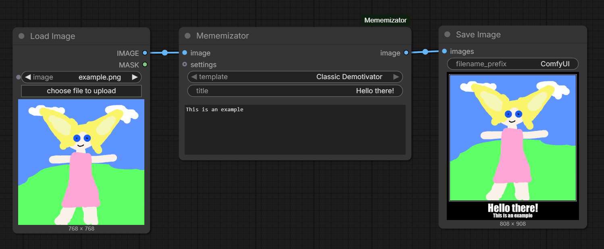
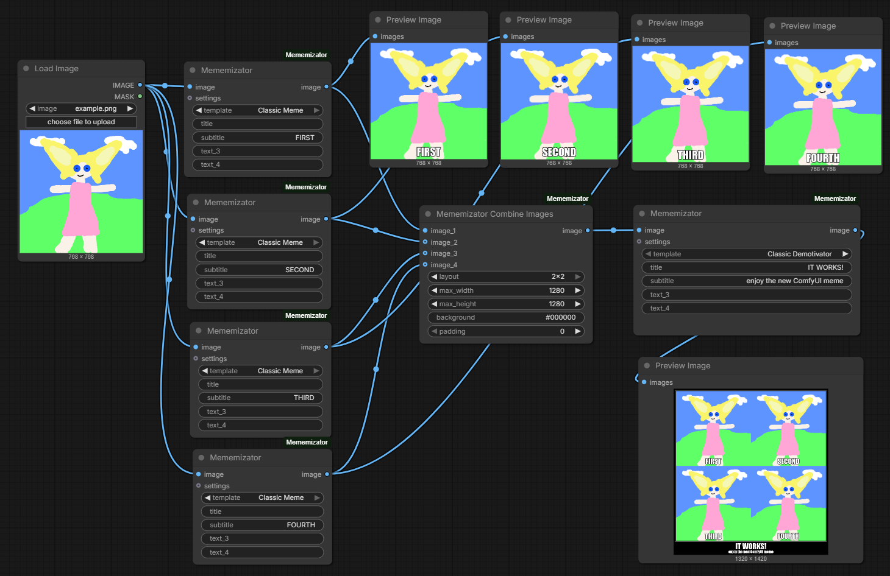

# ComfyUI-Mememizator

ComfyUI custom nodes for making memes and demotivators.

## Nodes

Mememizator:

- Name: `Mememizator`
- Class: `ArtemKo7vMememizator`
- Category: `ArtemKo7v`
- Required input image: `IMAGE`
- Optional input settings: `MEMEMIZATOR_SETTINGS`
- Output image: `IMAGE`

Mememizator Settings:

- Name: `Mememizator Settings`
- Class: `ArtemKo7vMememizatorSettings`
- Category: `ArtemKo7v`
- Output settings: `MEMEMIZATOR_SETTINGS`

Mememizator Combine Images:

- Name: `Mememizator Combine Images`
- Class: `ArtemKo7vMememizatorCombineImages`
- Category: `ArtemKo7v`
- Required input image: `IMAGE`
- Optional image inputs: `image_2`, `image_3`, `image_4`
- Output image: `IMAGE`

## Features

- Renders classic memes and demotivators from input images
- Supports template-based rendering through a user-editable JSON config
- Includes `Classic Demotivator` and `Classic Meme` templates by default
- Supports up to four text fields: `title`, `subtitle`, `text_3`, and `text_4`
- Supports per-workflow template overrides through the `Mememizator Settings` node
- Syncs the settings node fields from the selected template on the client side
- Downloads fonts referenced by templates into the user config directory
- Combines up to four images before meme rendering
- Supports `horizontal`, `vertical`, and `2x2` combine layouts
- Supports maximum combined output size, background color, and padding settings
- Handles single images and image batches

## Installation

Place this folder into your ComfyUI `custom_nodes` directory.

Install dependencies in the same Python environment used by ComfyUI:

```bash
pip install -e .
```

The package depends on Pillow and NumPy. PyTorch is expected to be available through ComfyUI.

## Configuration

On first launch the config file is saved to:

```text
ComfyUI/user/default/ComfyUI-Mememizator/config.json
```

Fonts referenced by templates are downloaded to:

```text
ComfyUI/user/default/ComfyUI-Mememizator/fonts/
```

For `Classic Demotivator` and `Classic Meme`, the node expects `impact.ttf` and downloads it from:

```text
https://font.download/dl/font/impact.zip
```

Edit the user config to add or change templates. Template names from `templates[].name` are shown in the node dropdown. After changing the list of templates, restart ComfyUI.

## Inputs

Mememizator:

- `image`: input image or image batch
- `template`: template selected from the current config
- `title`: first text line
- `subtitle`: second text line
- `text_3`: third text line
- `text_4`: fourth text line
- `settings`: optional overrides from `Mememizator Settings`

Mememizator Settings:

- `template_name`: template selected from the current config
- `background`: output background color
- `text`: text color
- `padding_x`: horizontal image offset or template padding override
- `padding_y`: vertical image offset or template padding override
- `frame_color`: frame color
- `frame_gap`: gap between image and frame
- `frame_thickness`: frame thickness
- `text_padding_x`: horizontal text padding
- `text_padding_bottom`: bottom text padding
- `text_position`: `below`, `above`, or `overlay`
- `outline_color`: text outline color
- `outline_thickness`: text outline thickness
- `gap_from_image`: gap between image and text area
- `block_spacing`: spacing between text blocks
- `multiline_spacing`: spacing between wrapped text lines
- `extra_width`: extra output canvas width
- `extra_height`: extra output canvas height
- `title_size`: title font size
- `title_min_size`: minimum title font size
- `subtitle_size`: subtitle font size
- `subtitle_min_size`: minimum subtitle font size
- `font_name`: template default font or a discovered font

Mememizator Combine Images:

- `image_1`: first input image or image batch
- `layout`: `horizontal`, `vertical`, or `2x2`
- `max_width`: maximum output width; `0` disables this limit
- `max_height`: maximum output height; `0` disables this limit
- `background`: background color
- `padding`: spacing around and between images
- `image_2`: optional second input image
- `image_3`: optional third input image
- `image_4`: optional fourth input image

## Outputs

- `Mememizator` returns the rendered meme or demotivator as `IMAGE`
- `Mememizator Settings` returns a `MEMEMIZATOR_SETTINGS` payload for the optional `settings` input
- `Mememizator Combine Images` returns the combined image as `IMAGE`

## Usage Examples

Basic Mememizator workflow:



Combine Images workflow:



Rendered example:


Workflows can be used from the images above or downloaded directly:

- [Basic workflow](examples/workflow_basic.json)
- [Settings workflow](examples/workflow_settings.json)
- [Combine workflow](examples/workflow_combine.json)

## Notes

- Connect `Mememizator Settings` to the optional `settings` input on `Mememizator` to override config values without editing JSON.
- Restart ComfyUI after changing code, installing dependencies, or changing the template list.
- Template values are read from the user config after it has been created on first launch.
- Image batch sizes must match, or optional combine inputs must contain a single image that can be broadcast across the batch.
