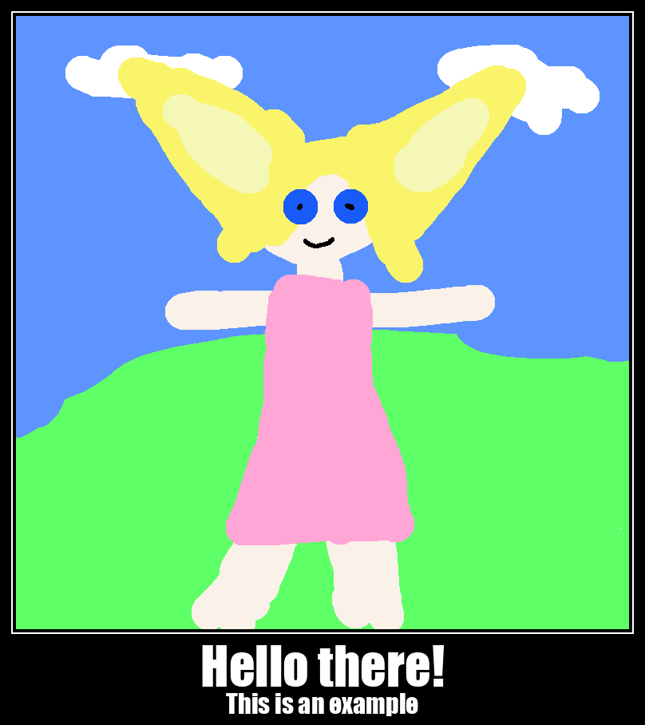

# ComfyUI-Mememizator
ComfyUI node to make memes and demotivators.

## Configuration

On first launch the config file will be saved to:

```text
ComfyUI/user/default/ComfyUI-Mememizator/config.json
```

Fonts referenced by templates are downloaded to:

```text
ComfyUI/user/default/ComfyUI-Mememizator/fonts/
```

For `Classic Demotivator`, the node expects `TR Impact.ttf` and downloads it from:

```text
https://font.download/dl/font/tr-impact.zip
```

`MememizatorSettings` node builds UI overrides for the main meme node. Connect it to the optional `settings` input on `Mememizator` node to override config values without editing JSON.

The settings node also includes a `template_name` dropdown. On the client side, it loads the current config and fills the other fields from the selected template.

Edit the user config to add or change templates. Template names from `templates[].name`
are shown in the node dropdown. After changing the list of templates, restart ComfyUI.

## Example



Workflow can be recreated from the screenshot above or imported directly from [example/workflow.json](example/workflow.json).
